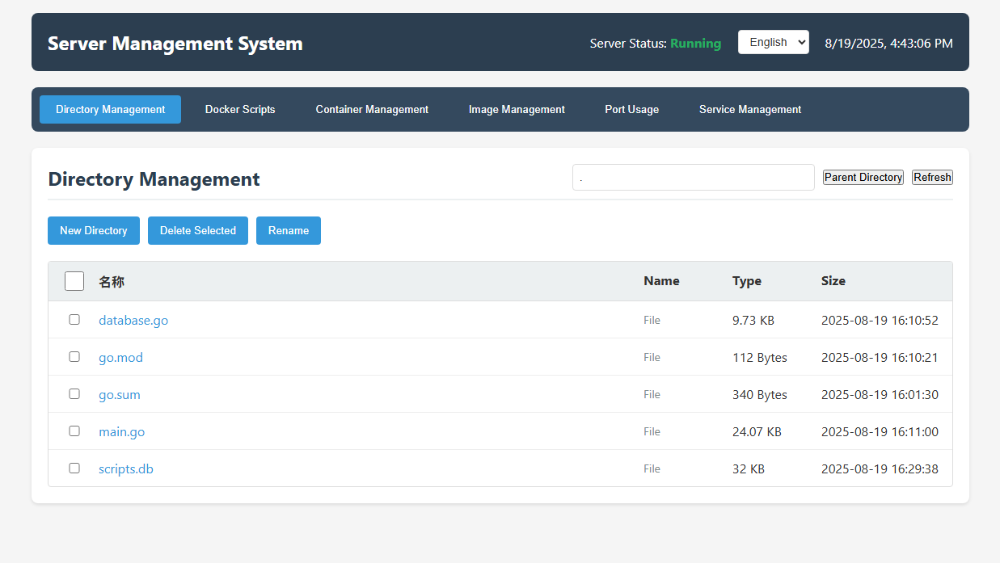

# Simple Server Management System

A web application based on Go backend and HTML frontend for managing server directories, Docker scripts, port usage, and service control.

## Screenshot



## Features

### 1. Directory Management
- Browse directory structure
- Create new directories
- Delete files and directories
- Rename files and directories
- View file size and modification time

### 2. Docker Script Management
- View Docker-related scripts
- Create new Docker startup scripts
- Delete scripts
- Execute scripts and view output results
- **New**: SQLite database storage for script information
- **New**: Execution logging and viewing
- **New**: Execution status tracking and performance monitoring

### 3. Port Usage Monitoring
- View current system port usage
- Display listening port numbers, process names, and PIDs
- Real-time port information refresh

### 4. Service Management
- View system service status
- Start, stop, restart services
- Display service PID, memory, and CPU usage

### 5. Multi-language Support
- **New**: Support for Chinese and English interface switching
- **New**: Dynamic language switching functionality
- **New**: All interface elements support multi-language display
- **New**: Language selector located in the top status bar

## Project Structure

```
server-manage/
├── backend/
│   ├── go.mod
│   ├── main.go
│   ├── database.go
│   └── scripts.db (generated at runtime)
└── frontend/
    ├── static/
    │   ├── css/
    │   │   └── style.css
    │   └── js/
    │       └── app.js
    └── templates/
        └── index.html
```

## Requirements

- Go 1.21+
- CGO enabled (for SQLite support)
- Modern web browser (ES6+ support)

## Installation and Running

### 1. Install Dependencies
```bash
cd backend
go mod tidy
```

### 2. Run the Service
```bash
cd backend
go run main.go database.go
```

### 3. Access the Application
Open your browser and visit `http://localhost:8080`

## API Endpoints

### Directory Management
- `GET /api/directory?path=<path>` - Get directory list
- `POST /api/directory` - Create directory
- `DELETE /api/directory` - Delete directory/file
- `PUT /api/directory/rename` - Rename directory/file

### Docker Script Management
- `GET /api/docker-scripts?path=<path>` - Get Docker script list
- `POST /api/docker-scripts` - Create Docker script
- `DELETE /api/docker-scripts` - Delete Docker script
- `POST /api/docker-scripts/execute` - Execute Docker script
- `GET /api/docker-scripts/logs?script_id=<id>&limit=<n>` - Get script execution logs
- `GET /api/docker-scripts/logs/all?limit=<n>` - Get all execution logs

### Database Management
- `GET /api/database/stats` - Get database statistics
- `POST /api/database/cleanup` - Clean up old log data
- `POST /api/database/backup` - Backup database
- `POST /api/database/restore` - Restore database

### Port Management
- `GET /api/ports` - Get port usage information

### Service Management
- `GET /api/services` - Get service status
- `POST /api/services/start` - Start service
- `POST /api/services/stop` - Stop service
- `POST /api/services/restart` - Restart service

## Usage Instructions

### Language Switching
1. Find the language selector in the top status bar
2. Click the dropdown menu to select "中文" or "English"
3. The interface will immediately switch to the selected language
4. Language selection is saved in browser local storage

### Directory Management
1. View current directory files and subdirectories in the "Directory Management" tab
2. Click directory names to enter that directory
3. Use the "Parent Directory" button to return to the previous directory
4. Select files or directories to perform delete or rename operations
5. Use the "Create Directory" button to create new directories

### Docker Script Management
1. View Docker-related script files in the "Docker Scripts" tab
2. Use the "Create Script" button to create new Docker startup scripts
3. Click the "View" button to view script content
4. Click the "Execute" button to run the script and view output results
5. **New**: Click the "Logs" button to view script execution history
6. **New**: Execution results include status, duration, execution time and other details
7. **New**: Support for viewing historical execution logs and output content

### Port Usage Monitoring
1. View current system port usage in the "Port Usage" tab
2. Display port numbers, process names, PIDs, and listening status
3. Use the "Refresh" button to update port information

### Service Management
1. View system service status in the "Service Management" tab
2. Display service names, status, PID, memory, and CPU usage
3. Use "Start", "Stop", "Restart" buttons to manage services

## Important Notes

1. Need to run with administrator privileges to perform certain system operations
2. Delete operations are irreversible, please operate with caution
3. Executing Docker scripts requires Docker to be installed on the system
4. Service management features require systemctl support
5. **New**: CGO enabled is required for SQLite database support
6. **New**: Script information is stored in SQLite database, automatically created on first run
7. **New**: All script executions are logged for tracking and debugging

## Security Considerations

1. Recommended to use in trusted network environments
2. Consider adding authentication and authorization mechanisms
3. Limit accessible directory ranges
4. Log important operations

## Tech Stack

- **Backend**: Go 1.21+, Gorilla Mux, SQLite3
- **Frontend**: HTML5, CSS3, JavaScript (ES6+)
- **System Commands**: netstat/ss, systemctl, ps, bash
- **Database**: SQLite (for storing script information and execution logs)
- **Internationalization**: Frontend JavaScript-based multi-language support system