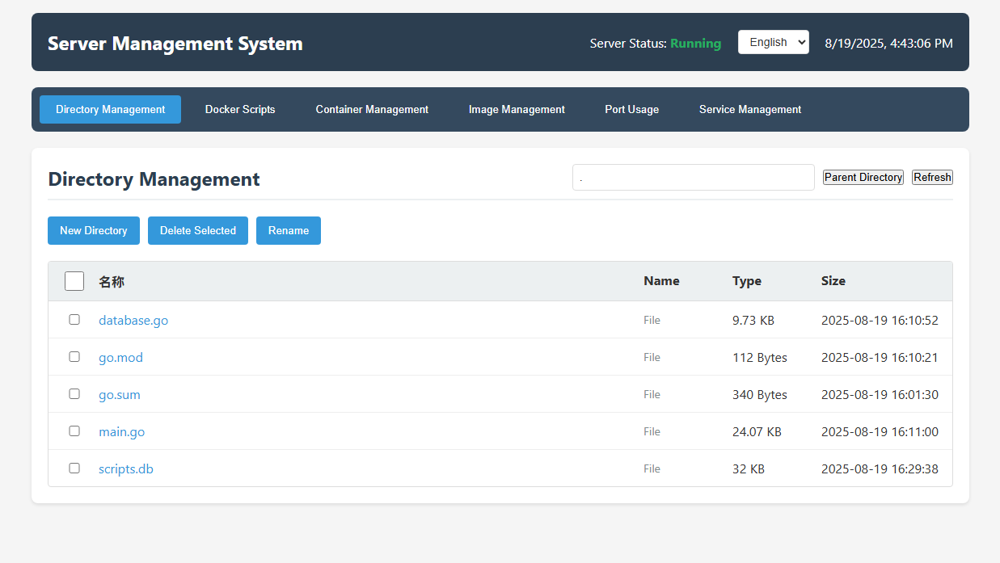

# 简易服务器管理系统

一个基于Go后端和HTML前端的Web应用，用于管理服务器上的目录、Docker脚本、端口占用和服务启停。

## 截图



## 功能特性

### 1. 目录管理
- 浏览目录结构
- 创建新目录
- 删除文件和目录
- 重命名文件和目录
- 查看文件大小和修改时间

### 2. Docker脚本管理
- 查看Docker相关脚本
- 创建新的Docker启动脚本
- 删除脚本
- 执行脚本并查看输出结果
- **新增**: SQLite数据库存储脚本信息
- **新增**: 执行日志记录和查看
- **新增**: 执行状态跟踪和性能监控

### 3. 端口占用查看
- 查看当前系统端口占用情况
- 显示监听的端口号、进程名和PID
- 实时刷新端口信息

### 4. 服务管理
- 查看系统服务状态
- 启动、停止、重启服务
- 显示服务的PID、内存和CPU使用情况

### 5. 多语言支持
- **新增**: 支持中文和英文界面切换
- **新增**: 动态语言切换功能
- **新增**: 所有界面元素都已支持多语言显示
- **新增**: 语言选择器位于页面顶部状态栏

## 项目结构

```
server-manage/
├── backend/
│   ├── go.mod
│   ├── main.go
│   ├── database.go
│   └── scripts.db (运行时生成)
└── frontend/
    ├── static/
    │   ├── css/
    │   │   └── style.css
    │   └── js/
    │       └── app.js
    └── templates/
        └── index.html
```

## 环境要求

- Go 1.21+
- CGO enabled (用于SQLite支持)
- 现代浏览器（支持ES6+）

## 安装和运行

### 1. 安装依赖
```bash
cd backend
go mod tidy
```

### 2. 运行服务
```bash
cd backend
go run main.go database.go
```

### 3. 访问应用
打开浏览器访问 `http://localhost:8080`

## API接口

### 目录管理
- `GET /api/directory?path=<path>` - 获取目录列表
- `POST /api/directory` - 创建目录
- `DELETE /api/directory` - 删除目录/文件
- `PUT /api/directory/rename` - 重命名目录/文件

### Docker脚本管理
- `GET /api/docker-scripts?path=<path>` - 获取Docker脚本列表
- `POST /api/docker-scripts` - 创建Docker脚本
- `DELETE /api/docker-scripts` - 删除Docker脚本
- `POST /api/docker-scripts/execute` - 执行Docker脚本
- `GET /api/docker-scripts/logs?script_id=<id>&limit=<n>` - 获取脚本执行日志
- `GET /api/docker-scripts/logs/all?limit=<n>` - 获取所有执行日志

### 数据库管理
- `GET /api/database/stats` - 获取数据库统计信息
- `POST /api/database/cleanup` - 清理旧日志数据
- `POST /api/database/backup` - 备份数据库
- `POST /api/database/restore` - 恢复数据库

### 端口管理
- `GET /api/ports` - 获取端口占用信息

### 服务管理
- `GET /api/services` - 获取服务状态
- `POST /api/services/start` - 启动服务
- `POST /api/services/stop` - 停止服务
- `POST /api/services/restart` - 重启服务

## 使用说明

### 多语言切换
1. 在页面顶部状态栏找到语言选择器
2. 点击下拉菜单选择"中文"或"English"
3. 界面会立即切换到选择的语言
4. 语言选择会保存在浏览器本地存储中

### 目录管理
1. 在"目录管理"标签页中查看当前目录的文件和子目录
2. 点击目录名称可以进入该目录
3. 使用"上级目录"按钮返回上一级目录
4. 选择文件或目录后可以执行删除、重命名操作
5. 使用"新建目录"按钮创建新的目录

### Docker脚本管理
1. 在"Docker脚本"标签页中查看Docker相关的脚本文件
2. 使用"创建脚本"按钮创建新的Docker启动脚本
3. 点击"查看"按钮查看脚本内容
4. 点击"执行"按钮运行脚本并查看输出结果
5. **新增**: 点击"日志"按钮查看脚本的执行历史记录
6. **新增**: 执行结果包含状态、耗时、执行时间等详细信息
7. **新增**: 支持查看历史执行日志和输出内容

### 端口占用查看
1. 在"端口占用"标签页中查看当前系统的端口占用情况
2. 显示端口号、进程名、PID和监听状态
3. 使用"刷新"按钮更新端口信息

### 服务管理
1. 在"服务管理"标签页中查看系统服务状态
2. 显示服务名称、状态、PID、内存和CPU使用情况
3. 使用"启动"、"停止"、"重启"按钮管理服务

## 注意事项

1. 需要以管理员权限运行以执行某些系统操作
2. 删除操作不可恢复，请谨慎操作
3. 执行Docker脚本需要确保系统已安装Docker
4. 服务管理功能需要systemctl支持
5. **新增**: 需要CGO enabled以支持SQLite数据库
6. **新增**: 脚本信息存储在SQLite数据库中，首次运行会自动创建
7. **新增**: 所有脚本执行都会记录日志，便于追踪和调试

## 安全考虑

1. 建议在受信任的网络环境中使用
2. 考虑添加身份验证和授权机制
3. 限制可访问的目录范围
4. 记录重要操作日志

## 技术栈

- **后端**: Go 1.21+, Gorilla Mux, SQLite3
- **前端**: HTML5, CSS3, JavaScript (ES6+)
- **系统命令**: netstat/ss, systemctl, ps, bash
- **数据库**: SQLite (用于存储脚本信息和执行日志)
- **国际化**: 前端JavaScript实现的多语言支持系统